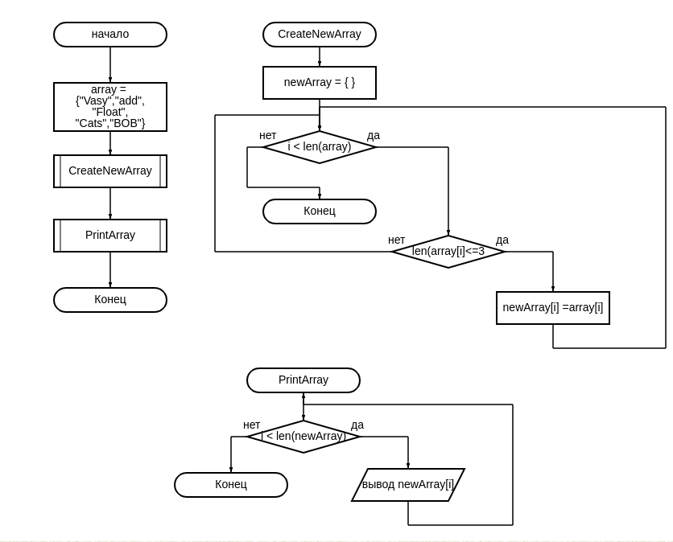

# Exam

__Суть данного проекта представлена на рисунке:__

В программе реализованны 2 метода:

1. CreateNewArray - отвечает за выборку из массива слов длинной не более 3-х символов.
2. PrintArray -  предназначен для вывода  результирующего массива слов в консоль.

Программа работает с заранее определенным массивом.

Функция len(* array *) - считает количество символов в слове.
